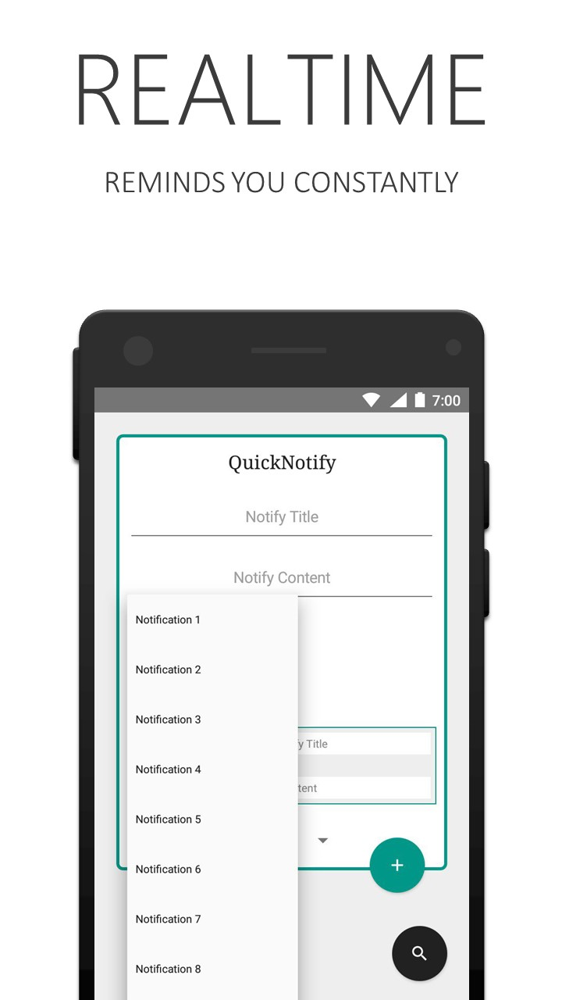

# Quick Notify

In the recent era of smart society, search is essential word of smartphone. Getting information at anytime, anyplace is becoming common these days. Quick helps you to search more easily and efficiently.

> A new way to save notes/ reminders in your notifications.

With Quick Notifications never forget little things anymore. It's an easy way to save notes or reminders as a notification. This reminder doesn't pop-up or rings, it just sits there and still does it's job most efficiently.

## Features

- New Concept.
- Rich and Easy User Interface.
- 12+ Search Engine Optmized.
- Quick URL Search.
- Works with Other Web Browsers.
- Upto 10 Notifications.
- Remove Notify Anytime.
- No unnecessary or complex features.

## Screen Shot

